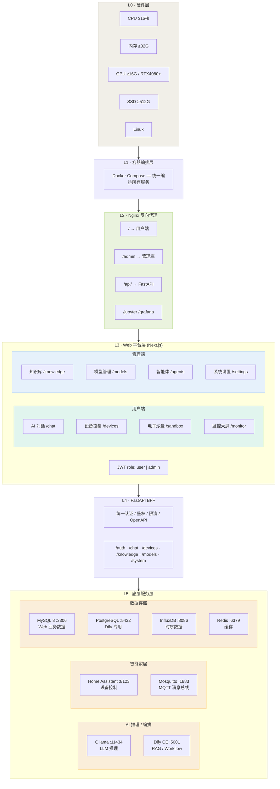

<div align="center">

# 🏠 基于智慧家居场景的大语言模型智能体科研应用平台

**Smart Home LLM Agent Research Platform**

[](https://python.org)
[](https://fastapi.tiangolo.com)
[](https://nextjs.org)
[](https://mysql.com)
[](LICENSE)

*面向科研场景的智慧家居 AI 一体机平台，集成大语言模型对话、智能体编排、设备控制、知识库 RAG 与电子沙盘于一体。*

</div>

---

## 📋 项目简介

本项目是一个**全栈智慧家居科研应用平台**，将大语言模型（LLM）技术与智能家居场景深度融合，为研究人员和开发者提供一站式的 AI + IoT 实验环境。

### 核心特性

| 特性 | 说明 |
|------|------|
| 🤖 **AI 对话** | 基于 Ollama 的本地 LLM 推理，支持多模型切换与流式对话 |
| 🧠 **智能体编排** | 集成 Dify CE，支持 RAG 知识库问答与 Workflow 工作流 |
| 🏠 **设备控制** | 对接 Home Assistant，实现灯光、空调、传感器等设备管理 |
| 📊 **电子沙盘** | 虚拟智能家居场景模拟，可视化设备联动与场景预设 |
| 📈 **监控大屏** | InfluxDB 时序数据驱动，实时展示设备状态与系统指标 |
| 🔒 **离线运行** | 全栈本地化部署，无需公网，适合内网科研环境 |

---

## 🏗️ 系统架构

```
六层架构 · 硬件 → 编排 → Nginx入口 → Web平台 → BFF → 底层服务
```



---

## 📁 项目结构

```
project/
├── smart-home-ai-frontend/        # Next.js 15 前端
│   ├── app/
│   │   ├── (user)/                # 用户端页面
│   │   │   ├── home/              # 品牌首页
│   │   │   ├── chat/              # AI 对话
│   │   │   ├── devices/           # 设备控制
│   │   │   ├── sandbox/           # 电子沙盘
│   │   │   └── monitor/           # 监控大屏
│   │   ├── (dashboard)/           # 管理端页面 (/admin)
│   │   │   └── admin/
│   │   │       ├── page.tsx       # 仪表盘
│   │   │       ├── users/         # 用户管理
│   │   │       ├── knowledge/     # 知识库管理
│   │   │       ├── models/        # 模型管理
│   │   │       ├── agents/        # 智能体管理
│   │   │       ├── settings/      # 系统设置
│   │   │       └── docs/          # API 文档
│   │   └── layout.tsx             # 根布局
│   ├── components/                # 公共组件
│   ├── lib/                       # 工具库 (API client, i18n)
│   └── public/                    # 静态资源
│
├── smart-home-ai-backend/         # FastAPI 后端
│   ├── app/
│   │   ├── routers/               # API 路由
│   │   │   ├── auth.py            # 认证 (登录/注册/JWT)
│   │   │   ├── users.py           # 用户管理 CRUD
│   │   │   ├── system.py          # 系统 (仪表盘/设置/连接测试)
│   │   │   ├── chat.py            # AI 对话
│   │   │   ├── devices.py         # 设备控制
│   │   │   ├── knowledge.py       # 知识库
│   │   │   ├── models_router.py   # 模型管理
│   │   │   ├── sandbox.py         # 电子沙盘
│   │   │   └── states.py          # 状态查询
│   │   ├── models/                # SQLAlchemy 模型
│   │   ├── schemas/               # Pydantic Schema
│   │   ├── services/              # 外部服务封装
│   │   │   ├── ollama.py          # Ollama LLM
│   │   │   ├── dify.py            # Dify 智能体
│   │   │   ├── homeassistant.py   # Home Assistant
│   │   │   └── influxdb.py        # InfluxDB
│   │   ├── config.py              # 配置管理 (pydantic-settings)
│   │   └── database.py            # 异步数据库连接
│   ├── .env.example               # 环境变量模板
│   └── requirements.txt           # Python 依赖
│
├── dify/                          # Dify 工作流配置
│   ├── 01 Main Orchestrator Chatflow.yml
│   ├── 02_home_control_workflow.yml
│   ├── 03_rag_qa_workflow.yml
│   └── kb-seed/                   # 知识库种子数据
│
├── start.sh                       # 一键启动脚本
└── .gitignore
```

---

## 🚀 快速开始

### 环境要求

| 依赖 | 版本 |
|------|------|
| Node.js | ≥ 18.x |
| Python | ≥ 3.12 |
| MySQL | ≥ 8.0 |
| Ollama | latest |

### 1. 克隆仓库

```bash
git clone git@github.com:sospink/smart-home-ai.git
cd smart-home-ai
```

### 2. 后端配置

```bash
cd smart-home-ai-backend

# 创建虚拟环境
python3 -m venv venv
source venv/bin/activate

# 安装依赖
pip install -r requirements.txt

# 配置环境变量
cp .env.example .env
# 编辑 .env，填入 MySQL 连接信息等
```

### 3. 前端配置

```bash
cd smart-home-ai-frontend

# 安装依赖
npm install

# 配置环境变量
echo "NEXT_PUBLIC_API_BASE_URL=http://localhost:8000/api/v1" > .env.local
```

### 4. 启动服务

```bash
# 方式一：一键启动（推荐）
./start.sh start

# 方式二：分别启动
# 后端
cd smart-home-ai-backend && source venv/bin/activate
uvicorn app.main:app --host 0.0.0.0 --port 8000 --reload

# 前端
cd smart-home-ai-frontend
npm run dev
```

### 5. 访问平台

| 服务 | 地址 |
|------|------|
| 用户端 | http://localhost:3000 |
| 管理后台 | http://localhost:3000/admin |
| API 文档 | http://localhost:8000/api/docs |

> 默认管理员账号：`admin`，初始密码请联系管理员获取。

---

## 🛠️ 技术栈

### 前端

| 技术 | 用途 |
|------|------|
| Next.js 15 (App Router) | React 框架 |
| Tailwind CSS | 样式系统 |
| shadcn/ui | UI 组件库 |
| Framer Motion | 动画引擎 |
| Lucide React | 图标库 |

### 后端

| 技术 | 用途 |
|------|------|
| FastAPI | Web 框架 (BFF 模式) |
| SQLAlchemy 2.0 | ORM (异步) |
| aiomysql | MySQL 异步驱动 |
| Pydantic v2 | 数据校验 |
| python-jose | JWT 认证 |
| httpx | 异步 HTTP 客户端 |

### 外部服务

| 服务 | 用途 | 端口 |
|------|------|------|
| Ollama | 本地 LLM 推理 | 11434 |
| Dify CE | 智能体编排 / RAG | 5001 |
| Home Assistant | IoT 设备控制 | 8123 |
| InfluxDB | 时序数据存储 | 8086 |
| MySQL 8 | 业务数据 | 3306 |
| Redis | 缓存 | 6379 |

---

## 📊 开发进度

> 📅 最后更新：2026-03-19 &nbsp; · &nbsp; 📈 总体完成度：**~35%**

### 用户端

| 模块 | 路由 | 前端 | 后端 | 联调 | 状态 |
|------|------|:----:|:----:|:----:|:----:|
| 首页 Landing | `/home` | ✅ | — | — | ✅ 完成 |
| AI 对话 | `/chat` | 🔲 | 🔲 | 🔲 | 待开发 |
| 设备控制 | `/devices` | 🔲 | 🔲 | 🔲 | 待开发 |
| 电子沙盘 | `/sandbox` | 🔲 | 🔲 | 🔲 | 待开发 |
| 监控大屏 | `/monitor` | 🔲 | 🔲 | 🔲 | 待开发 |
| 登录 / 注册 | `/` | ✅ | ✅ | ✅ | ✅ 完成 |

### 管理端

| 模块 | 路由 | 前端 | 后端 | 联调 | 状态 |
|------|------|:----:|:----:|:----:|:----:|
| 仪表盘 | `/admin` | ✅ | ✅ | ✅ | ✅ 完成 |
| 用户管理 | `/admin/users` | ✅ | ✅ | ✅ | ✅ 完成 |
| 系统设置 | `/admin/settings` | ✅ | ✅ | ✅ | ✅ 完成 |
| API 文档 | `/admin/docs` | ✅ | — | — | ✅ 完成 |
| 知识库管理 | `/admin/knowledge` | 🔲 | 🔲 | 🔲 | 待开发 |
| 模型管理 | `/admin/models` | 🔲 | 🔲 | 🔲 | 待开发 |
| 智能体管理 | `/admin/agents` | 🔲 | 🔲 | 🔲 | 待开发 |

### 基础设施

| 组件 | 状态 |
|------|:----:|
| FastAPI 框架 + 路由注册 | ✅ |
| MySQL + SQLAlchemy ORM | ✅ |
| JWT 认证系统 | ✅ |
| Next.js App Router | ✅ |
| 管理后台 Layout（可折叠侧边栏） | ✅ |
| i18n 国际化（中/英） | ✅ |
| 外部服务封装（Ollama/Dify/HA/InfluxDB） | ✅ |

---

## 📄 许可证

本项目仅供科研学习用途。

---

<div align="center">

**基于智慧家居场景的大语言模型智能体科研应用平台** · © 2025

</div>
