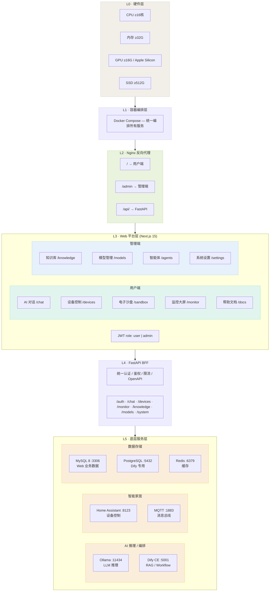

<div align="center">

# 🏠 基于智慧家居场景的大语言模型智能体科研应用平台

**Smart Home LLM Agent Research Platform**

[](https://python.org)
[](https://fastapi.tiangolo.com)
[](https://nextjs.org)
[](https://mysql.com)
[](https://www.home-assistant.io)
[](https://ollama.com)
[](LICENSE)

*面向科研场景的智慧家居 AI 一体机平台，集成大语言模型对话、智能体编排、设备控制、知识库 RAG 与监控大屏于一体。*

</div>

---

## 📋 项目简介

本项目是一个**全栈智慧家居科研应用平台**，将大语言模型（LLM）技术与智能家居场景深度融合，为研究人员和开发者提供一站式的 AI + IoT 实验环境。

### 核心特性

| 特性 | 说明 |
|------|------|
| 🤖 **AI 对话** | 基于 Dify Chatflow 的流式对话，支持多模型切换、会话管理、Markdown 渲染 |
| 🧠 **智能体编排** | 集成 Dify CE，支持主入口路由 + 4 个子工作流（家居控制/RAG/数据分析/冒烟测试） |
| 🏠 **设备控制** | 对接 Home Assistant REST API，支持 11 个逻辑设备的实时状态监控与远程控制 |
| 📊 **监控大屏** | 实时系统资源 + AI 模型状态 + 传感器历史 + 操作日志 + 服务健康检测 |
| 📈 **电子沙盘** | 虚拟智能家居场景模拟，可视化设备联动与场景预设（开发中） |
| 🔒 **离线运行** | 全栈本地化部署，无需公网，适合内网科研环境 |
| 🔧 **管理后台** | 用户管理、模型管理、知识库管理、系统设置、API 文档 |

---

## 🏗️ 系统架构

```
六层架构 · 硬件 → 编排 → Nginx入口 → Web平台 → BFF → 底层服务
```



---

## 📁 项目结构

```
project/
├── smart-home-ai-frontend/        # Next.js 15 前端
│   ├── app/
│   │   ├── (user)/                # 用户端页面
│   │   │   ├── home/              # 品牌首页
│   │   │   ├── chat/              # AI 对话（Dify SSE）
│   │   │   ├── devices/           # 设备控制（HA 对接）
│   │   │   ├── sandbox/           # 电子沙盘
│   │   │   ├── monitor/           # 监控大屏（实时数据）
│   │   │   └── docs/              # 帮助文档
│   │   ├── (dashboard)/           # 管理端页面 (/admin)
│   │   │   └── admin/
│   │   │       ├── page.tsx       # 仪表盘
│   │   │       ├── users/         # 用户管理（CRUD）
│   │   │       ├── knowledge/     # 知识库管理（Dify）
│   │   │       ├── models/        # 模型管理（Ollama）
│   │   │       ├── agents/        # 智能体管理
│   │   │       ├── settings/      # 系统设置
│   │   │       └── docs/          # API 文档
│   │   └── login/page.tsx         # 登录页
│   ├── components/                # 公共组件
│   ├── lib/api/                   # API 客户端封装
│   └── public/                    # 静态资源
│
├── smart-home-ai-backend/         # FastAPI 后端
│   ├── app/
│   │   ├── routers/               # API 路由
│   │   │   ├── auth.py            # 认证（登录/注册/JWT）+ 登录日志
│   │   │   ├── users.py           # 用户管理 CRUD
│   │   │   ├── system.py          # 系统（仪表盘/设置/连接测试）
│   │   │   ├── chat.py            # AI 对话（Dify SSE 代理）
│   │   │   ├── devices.py         # 设备控制（HA 代理 + 操作日志）
│   │   │   ├── monitor.py         # 监控大屏（7 个子接口）
│   │   │   ├── knowledge.py       # 知识库（Dify 代理）
│   │   │   ├── models_router.py   # 模型管理（Ollama）
│   │   │   ├── sandbox.py         # 电子沙盘
│   │   │   └── states.py          # 状态查询
│   │   ├── models/                # SQLAlchemy 模型
│   │   │   ├── user.py            # 用户表
│   │   │   ├── operation_log.py   # 操作日志表
│   │   │   └── system_config.py   # 系统配置表
│   │   ├── schemas/               # Pydantic Schema
│   │   ├── services/              # 外部服务封装
│   │   │   ├── ollama.py          # Ollama LLM
│   │   │   ├── dify.py            # Dify 智能体
│   │   │   ├── dify_knowledge.py  # Dify 知识库
│   │   │   ├── homeassistant.py   # Home Assistant
│   │   │   └── influxdb.py        # InfluxDB（预留）
│   │   ├── config.py              # 配置管理（YAML + env）
│   │   └── database.py            # 异步数据库连接
│   ├── config.yaml                # 统一配置文件
│   └── requirements.txt           # Python 依赖
│
├── dify/                          # Dify 工作流配置
│   ├── 01 Main Orchestrator Chatflow.yml
│   ├── 02_home_control_workflow.yml
│   ├── 03_rag_qa_workflow.yml
│   ├── 04_data_analysis_workflow.yml
│   └── 05_orchestration_smoke_test_workflow.yml
│
├── docs/                              # 📚 项目文档（按用途分类）
│   ├── contract/                      # 合同与验收
│   │   ├── 合同技术要求-江门定开.md      # 合同原文（40 条技术要求）
│   │   ├── contract-progress-20260325.md  # 合同完成度对比报告
│   │   └── phase1_contract_compliance.md  # Phase 1 合规性报告
│   ├── deploy/                        # 部署与运维
│   │   ├── delivery-smart-home.md     # 交付文档
│   │   ├── deploy-report-20260321.md  # 部署报告
│   │   ├── fix-20260321.md            # 修复记录
│   │   └── 智慧家居LLM智能体一体机_部署运维手册.md
│   ├── design/                        # 设计与架构
│   │   ├── api.md                     # API 接口设计
│   │   ├── page_specs.md              # 页面功能规格书
│   │   ├── 智慧家居Web平台_架构设计文档.md
│   │   ├── 智慧家居LLM智能体一体机_项目规划.md
│   │   └── 技术调研笔记_Dify与HA关键问题.md
│   ├── progress-20260325.md           # 最新进度报告
│   ├── hardware_integration_guide.md  # 硬件对接指南
│   ├── 智慧家居LLM智能体一体机_开发排期表.md
│   └── 智慧家居LLM智能体一体机_项目汇报.md
│
├── docker-service/                    # 🐳 Docker 服务配置
│   ├── docker-compose.yml             # 服务编排（HA/MySQL/Redis/Nginx）
│   ├── ha-config/                     # Home Assistant 配置
│   │   └── configuration.yaml         # HA 主配置
│   ├── ha-virtual-devices.yaml        # HA 虚拟设备定义（18 个实体）
│   ├── DEPLOY.md                      # 部署说明
│   ├── README-HomeAssistant.md        # HA 配置说明
│   └── .env.example                   # 环境变量模板
│
├── docker-compose.yml                 # Docker 编排（项目级）
├── nginx.conf                         # Nginx 反向代理
├── start.sh                           # 一键启动脚本
└── .gitignore
```

---

## 🚀 快速开始

### 环境要求

| 依赖 | 版本 |
|------|------|
| Node.js | ≥ 18.x |
| Python | ≥ 3.12 |
| MySQL | ≥ 8.0 |
| Ollama | latest |
| Home Assistant | ≥ 2024.x |

### 1. 克隆仓库

```bash
git clone git@github.com:sospink/smart-home-ai.git
cd smart-home-ai
```

### 2. 后端配置

```bash
cd smart-home-ai-backend

# 创建虚拟环境
python3 -m venv venv
source venv/bin/activate

# 安装依赖
pip install -r requirements.txt

# 配置文件（推荐使用 config.yaml）
cp config.yaml.example config.yaml
# 编辑 config.yaml 填入 MySQL/HA/Dify/Ollama 的连接信息
```

### 3. 前端配置

```bash
cd smart-home-ai-frontend

# 安装依赖
npm install

# 配置环境变量
echo "NEXT_PUBLIC_API_BASE_URL=http://localhost:8000/api/v1" > .env.local
```

### 4. 启动服务

```bash
# 方式一：一键启动（推荐）
./start.sh start

# 方式二：分别启动
# 后端
cd smart-home-ai-backend && source venv/bin/activate
uvicorn app.main:app --host 0.0.0.0 --port 8000 --reload

# 前端
cd smart-home-ai-frontend
npm run dev
```

### 5. 访问平台

| 服务 | 地址 |
|------|------|
| 用户端 | http://localhost:3000 |
| 管理后台 | http://localhost:3000/admin |
| API 文档 | http://localhost:8000/api/docs |
| Home Assistant | http://localhost:8123 |

> 默认管理员账号：`admin`，初始密码请联系管理员获取。

---

## 🛠️ 技术栈

### 前端

| 技术 | 用途 |
|------|------|
| Next.js 15 (App Router) | React 框架 |
| Tailwind CSS | 样式系统 |
| shadcn/ui | UI 组件库 |
| Framer Motion | 动画引擎 |
| Lucide React | 图标库 |
| React Three Fiber | 3D 渲染（电子沙盘） |

### 后端

| 技术 | 用途 |
|------|------|
| FastAPI | Web 框架 (BFF 模式) |
| SQLAlchemy 2.0 | ORM (异步) |
| aiomysql | MySQL 异步驱动 |
| Pydantic v2 | 数据校验 |
| python-jose | JWT 认证 |
| httpx | 异步 HTTP 客户端 |
| psutil | 系统资源监控 |

### 外部服务

| 服务 | 用途 | 端口 |
|------|------|------|
| Ollama | 本地 LLM 推理（Qwen3:4B） | 11434 |
| Dify CE | 智能体编排 / RAG / Workflow | 5001 |
| Home Assistant | IoT 设备控制 | 8123 |
| MySQL 8 | 业务数据 | 3306 |
| Redis | 缓存 | 6379 |
| Nginx | 反向代理 | 8088 |

---

## 📊 开发进度

> 📅 最后更新：2026-03-25 &nbsp; · &nbsp; 📈 总体完成度：**~75%**

### 用户端

| 模块 | 路由 | 前端 | 后端 | 联调 | 状态 |
|------|------|:----:|:----:|:----:|:----:|
| 首页 Landing | `/home` | ✅ | — | — | ✅ 完成 |
| AI 对话 | `/chat` | ✅ | ✅ | ✅ | ✅ 完成 |
| 设备控制 | `/devices` | ✅ | ✅ | ✅ | ✅ 完成 |
| 监控大屏 | `/monitor` | ✅ | ✅ | ✅ | ✅ 完成 |
| 帮助文档 | `/docs` | ✅ | — | — | ✅ 完成 |
| 电子沙盘 | `/sandbox` | 🔲 | 🔲 | 🔲 | 待开发 |
| 登录 / 注册 | `/login` | ✅ | ✅ | ✅ | ✅ 完成 |

### 管理端

| 模块 | 路由 | 前端 | 后端 | 联调 | 状态 |
|------|------|:----:|:----:|:----:|:----:|
| 仪表盘 | `/admin` | ✅ | ✅ | ✅ | ✅ 完成 |
| 用户管理 | `/admin/users` | ✅ | ✅ | ✅ | ✅ 完成 |
| 系统设置 | `/admin/settings` | ✅ | ✅ | ✅ | ✅ 完成 |
| API 文档 | `/admin/docs` | ✅ | — | — | ✅ 完成 |
| 知识库管理 | `/admin/knowledge` | ✅ | ✅ | ✅ | ✅ 完成 |
| 模型管理 | `/admin/models` | ✅ | ✅ | ✅ | ✅ 完成 |
| 智能体管理 | `/admin/agents` | ✅ | 🔲 | 🔲 | UI 完成 |

### 后端 API

| 模块 | 路由文件 | 完成度 | 说明 |
|------|----------|:------:|------|
| 认证 | auth.py | **100%** | JWT + 角色鉴权 + 登录日志 |
| 用户管理 | users.py | **100%** | CRUD + 启用/禁用 |
| 系统设置 | system.py | **100%** | 仪表盘 + 连接测试 + 系统配置 |
| AI 对话 | chat.py | **95%** | Dify SSE 代理 + 会话管理 + 消息列表 |
| 设备控制 | devices.py | **95%** | HA REST API 代理 + 操作日志 + 逻辑设备注册 |
| 监控大屏 | monitor.py | **95%** | 7 个子接口 + 多源聚合 + 超时保护 |
| 模型管理 | models_router.py | **90%** | Ollama API 完整封装 |
| 知识库 | knowledge.py | **85%** | Dify Knowledge API 代理 |
| 电子沙盘 | sandbox.py | **10%** | 占位 |
| 状态查询 | states.py | **10%** | 占位 |

### 监控大屏接口详情

| 接口 | 数据来源 | 状态 |
|------|---------|:----:|
| `GET /monitor/resources` | psutil (CPU/内存/GPU/磁盘) | ✅ |
| `GET /monitor/ai-status` | Ollama API (模型/状态/参数规模) | ✅ |
| `GET /monitor/services` | 多服务 HTTP 健康检测 | ✅ |
| `GET /monitor/activity` | Dify + MySQL + Ollama 聚合 | ✅ |
| `GET /monitor/control-trends` | MySQL GROUP BY 小时聚合 | ✅ |
| `GET /monitor/sensor-history` | HA History API + 模拟混合 | ✅ |
| `GET /monitor/logs` | operation_logs 表 | ✅ |
| `GET /monitor/dashboard` | 以上数据聚合一次返回 | ✅ |

### 基础设施

| 组件 | 状态 |
|------|:----:|
| FastAPI 框架 + 路由注册 | ✅ |
| MySQL + SQLAlchemy ORM (异步) | ✅ |
| JWT 认证系统 (角色鉴权) | ✅ |
| Next.js 15 App Router | ✅ |
| 管理后台 Layout（可折叠侧边栏） | ✅ |
| i18n 国际化（中/英） | ✅ |
| config.yaml 统一配置管理 | ✅ |
| 外部服务封装（Ollama/Dify/HA/InfluxDB） | ✅ |
| 操作日志系统 (operation_log) | ✅ |
| Docker Compose 部署编排 | ✅ |
| Nginx 反向代理 | ✅ |
| 一键启动脚本 (start.sh) | ✅ |

---

## 📄 许可证

本项目仅供科研学习用途。

---

<div align="center">

**基于智慧家居场景的大语言模型智能体科研应用平台** · © 2025-2026

</div>
