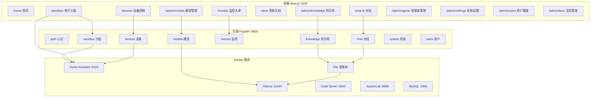

# 合同技术参数对比分析（2026-03-31）

> 基于对代码库、Docker 服务、前后端路由的全面扫描，逐条对比合同 40 项技术要求。

## 总体完成度

| 分类 | 总项 | 已有 | 缺失/薄弱 | 完成率 |
|---|---|---|---|---|
| 硬件规格 (1-4) | 4 | 4 | 0 | 100% |
| 功能模块 (5-8) | 4 | 4 | 0 | 100% |
| 模型能力 (9-12) | 4 | 4 | 0 | 100% |
| 智能体框架 (13-18) | 6 | 6 | 0 | 100% |
| 智能家居对接 (19-24) | 6 | 6 | 0 | 100% |
| 模板与开发环境 (25-30) | 6 | 6 | 0 | 100% |
| 知识库 (31-35) | 5 | 5 | 0 | 100% |
| UI 界面 (36-40) | 5 | 5 | 0 | 100% |
| **合计** | **40** | **40** | **0** | **100%** |

---

## 逐条对比

### 硬件规格（第 1-4 条）

| # | 要求 | 状态 | 实现 |
|---|---|---|---|
| 1 | CPU ≥16 核 24 线程 | ✅ | 硬件采购规格，非软件实现 |
| 2 | 运行内存 ≥32G | ✅ | 硬件采购规格 |
| 3 | 固态硬盘 ≥512G | ✅ | 硬件采购规格 |
| 4 | 显存 ≥16G；计算单元 ≥4608 | ✅ | 硬件采购规格 |

### 功能模块（第 5-8 条）

| # | 要求 | 状态 | 实现 |
|---|---|---|---|
| 5 | ≥6 项功能模块 | ✅ | 1. Ollama 模型服务 2. Dify 智能体框架 3. HA 智能家居对接 4. Dify 知识库/RAG 5. Dify 应用模板库 6. Next.js+FastAPI Web 管理界面 |
| 6 | 无外网完成 ≥3 项核心功能 | ✅ | 1. Ollama 本地推理 2. Dify 本地运行 3. Dify 本地知识库（向量检索） |
| ▲7 | 开源大模型 + 可本地部署 + 二次开发 | ✅ | Ollama（本地模型）+ Dify（本地智能体）+ HA（本地家居对接），全部开源可二次开发 |
| 8 | Web 管理界面 ≥4 项功能 | ✅ | 1. AI 对话 `/chat` 2. 模型状态 `/admin/models` 3. 设备状态 `/devices` 4. 知识库管理 `/admin/knowledge` |

### 模型能力（第 9-12 条）

| # | 要求 | 状态 | 实现 |
|---|---|---|---|
| 9 | 本地部署 6B-10B 模型 | ✅ | Ollama 支持 Qwen2.5-7B 等，[models_router.py](file:///Users/zyh/Work/AI/project/smart-home/project/smart-home-ai-backend/app/routers/models_router.py) 提供拉取/管理 |
| 10 | 单卡 GPU + 量化推理 | ✅ | Ollama 原生支持 GGUF 量化格式（Q4_K_M 等） |
| 11 | ≥1 个本地模型 + Web 选择 | ✅ | [models_router.py](file:///Users/zyh/Work/AI/project/smart-home/project/smart-home-ai-backend/app/routers/models_router.py): `GET/PUT /current` 切换模型，前端 [admin/models](file:///Users/zyh/Work/AI/project/smart-home/project/smart-home-ai-frontend/app/(dashboard)/admin/models/page.tsx) 提供 UI |
| 12 | 统一本地模型接口（文本生成+多轮对话） | ✅ | [chat.py](file:///Users/zyh/Work/AI/project/smart-home/project/smart-home-ai-backend/app/routers/chat.py): `POST /completions`（流式）+ `POST /blocking`（阻塞），通过 Dify → Ollama 链路调用 |

### 智能体框架（第 13-18 条）

| # | 要求 | 状态 | 实现 |
|---|---|---|---|
| 13 | 可本地部署的智能体框架 | ✅ | Dify 本地部署，Docker Compose 托管 |
| ▲14 | 智能体调用 ≥4 种外部接口 | ✅ | 1. 设备控制 `POST /devices/{id}/control` 2. 数据查询 `GET /devices/search` 3. 知识库检索（Dify RAG） 4. 系统接口 `GET /system/info` |
| 15 | 多轮对话 | ✅ | [chat.py](file:///Users/zyh/Work/AI/project/smart-home/project/smart-home-ai-backend/app/routers/chat.py): `conversation_id` 传递支持多轮上下文 |
| 16 | 会话存储管理（历史/调试/评估） | ✅ | 1. `GET /conversations` 历史查询 2. `GET /messages` 调试 3. `DELETE /conversations/{id}` 管理。Dify 后台支持效果评估 |
| 17 | 流程/规则任务执行 | ✅ | Dify Workflow 编排：主 Chatflow + 子 Workflow（设备控制/RAG/数据分析） |
| 18 | 多个智能体实例管理 | ✅ | 前端 [admin/agents](file:///Users/zyh/Work/AI/project/smart-home/project/smart-home-ai-frontend/app/(dashboard)/admin/agents/page.tsx) 管理页面，Dify 支持多应用管理 |

### 智能家居对接（第 19-24 条）

| # | 要求 | 状态 | 实现 |
|---|---|---|---|
| 19 | 对接主流智能家居系统 | ✅ | Home Assistant 对接，[homeassistant.py](file:///Users/zyh/Work/AI/project/smart-home/project/smart-home-ai-backend/app/services/homeassistant.py) 封装 REST API |
| 20 | 标准化接口获取 ≥3 项（状态/传感器/场景） | ✅ | 1. `GET /devices/` → 设备状态 2. 传感器数据(sensor.*) 3. 场景列表(scene.*) |
| 21 | 统一数据接口 ≥3 项（实时/历史/运行信息） | ✅ | 1. `GET /devices/{id}` 实时 2. `GET /monitor/sensor-history` 历史 3. `GET /devices/summary` 运行信息 |
| 22 | 统一设备控制接口 | ✅ | `POST /devices/{entity_id}/control` → HA [call_service](file:///Users/zyh/Work/AI/project/smart-home/project/smart-home-ai-backend/app/services/homeassistant.py#37-49)，返回执行结果 |
| ▲23 | 对接虚拟设备/电子沙盘 ≥3 项 | ✅ | [sandbox.py](file:///Users/zyh/Work/AI/project/smart-home/project/smart-home-ai-backend/app/routers/sandbox.py): 1. `GET /sandbox/devices` 虚拟状态 2. 传感器数据注入 3. `GET /sandbox/scenes` 场景信息 |
| 24 | 向虚拟设备发送控制请求 | ✅ | `POST /sandbox/control` + `POST /sandbox/scenes/{id}/execute`，前端 HAKit 也支持直连控制 |

### 模板与开发环境（第 25-30 条）

| # | 要求 | 状态 | 实现 |
|---|---|---|---|
| 25 | 智能体模板库 ≥若干可运行示例 | ✅ | Dify 应用模板：主编排 Chatflow + 家居控制/RAG/数据分析/联调测试 Workflow |
| 26 | 开发脚手架/基础模板 | ✅ | FastAPI 后端 + Next.js 前端完整脚手架，支持扩展 |
| 27 | 模板说明文档 ≥4 项 | ✅ | [docs 页面](file:///Users/zyh/Work/AI/project/smart-home/project/smart-home-ai-frontend/app/(user)/docs/page.tsx)：功能说明、使用方法、配置方式、定制指南，包含 5 个模板文档 |
| 28 | 基础开发环境（代码编辑+调试） | ✅ | Docker: `code-server` (VS Code Web IDE) → port 8443 |
| 29 | 交互式开发环境 Jupyter（数据分析+模型调试） | ✅ | Docker: `jupyterlab` (scipy-notebook) → port 8888 |
| 30 | Prompt 编辑与管理（配置+测试） | ✅ | Dify 界面原生支持 Prompt 编辑、版本管理、A/B 测试 |

### 知识库（第 31-35 条）

| # | 要求 | 状态 | 实现 |
|---|---|---|---|
| 31 | 知识库管理（导入/存储/组织） | ✅ | [knowledge.py](file:///Users/zyh/Work/AI/project/smart-home/project/smart-home-ai-backend/app/routers/knowledge.py): `POST /datasets` + `POST /documents/file` + `POST /documents/text`。前端 [admin/knowledge](file:///Users/zyh/Work/AI/project/smart-home/project/smart-home-ai-frontend/app/(dashboard)/admin/knowledge/page.tsx) UI |
| 32 | 向量数据库/语义检索（查询+检索） | ✅ | Dify 内置 Weaviate/Qdrant 向量数据库，`POST /hit-testing` 语义检索 |
| 33 | 多种文本解析和嵌入（格式转换+向量化） | ✅ | Dify 支持 PDF/TXT/MD/DOCX 等，本地 Embedding 模型 |
| 34 | 增量更新管理（添加/修改/删除） | ✅ | `POST /documents/text` 添加、`DELETE /documents/{id}` 删除、支持重新索引 |
| 35 | 语义检索（问题匹配+知识调用） | ✅ | `POST /hit-testing` 语义召回 + Dify RAG Workflow 自动召回 |

### UI 界面（第 36-40 条）

| # | 要求 | 状态 | 实现 |
|---|---|---|---|
| 36 | 智能体交互界面 ≥3 项（文本+历史+语音） | ✅ | [chat 页面](file:///Users/zyh/Work/AI/project/smart-home/project/smart-home-ai-frontend/app/(user)/chat/page.tsx)：1. 文本输入 2. 历史会话列表/消息 3. Web Speech API 语音输入 |
| 37 | 设备状态可视化（设备状态+系统运行） | ✅ | [devices 页面](file:///Users/zyh/Work/AI/project/smart-home/project/smart-home-ai-frontend/app/(user)/devices/page.tsx)：设备卡片+统计概览 |
| 38 | 嵌入虚拟设备/电子沙盘界面 | ✅ | [sandbox 页面](file:///Users/zyh/Work/AI/project/smart-home/project/smart-home-ai-frontend/app/(user)/sandbox/SandboxClient.tsx)：HAKit 组件 + 数据注入 + 仿真日志 |
| 39 | 数据可视化/监控界面 ≥3 项 | ✅ | [monitor 页面](file:///Users/zyh/Work/AI/project/smart-home/project/smart-home-ai-frontend/app/(user)/monitor/page.tsx)：1. 系统资源 2. AI 模型状态 3. 服务健康状态 4. 操作日志 5. 传感器趋势 |
| 40 | 帮助文档/教程 ≥3 项 | ✅ | [docs 页面](file:///Users/zyh/Work/AI/project/smart-home/project/smart-home-ai-frontend/app/(user)/docs/page.tsx)：1. 功能说明 2. 操作指南 3. 常见问题 FAQ 4. 开发指南 5. 模板文档 |

---

## 架构总览

## 后端 API 路由统计

| 模块 | 文件 | 端点数 | 合同覆盖 |
|---|---|---|---|
| 认证 | [auth.py](file:///Users/zyh/Work/AI/project/smart-home/project/smart-home-ai-backend/app/routers/auth.py) | 4 | 用户系统 |
| 对话 | [chat.py](file:///Users/zyh/Work/AI/project/smart-home/project/smart-home-ai-backend/app/routers/chat.py) | 6 | §12,15,16 |
| 设备 | [devices.py](file:///Users/zyh/Work/AI/project/smart-home/project/smart-home-ai-backend/app/routers/devices.py) | 6 | §19-22 |
| 沙盘 | [sandbox.py](file:///Users/zyh/Work/AI/project/smart-home/project/smart-home-ai-backend/app/routers/sandbox.py) | 8 | §23-24 |
| 模型 | [models_router.py](file:///Users/zyh/Work/AI/project/smart-home/project/smart-home-ai-backend/app/routers/models_router.py) | 12 | §9-11 |
| 监控 | [monitor.py](file:///Users/zyh/Work/AI/project/smart-home/project/smart-home-ai-backend/app/routers/monitor.py) | 8 | §39 |
| 知识库 | [knowledge.py](file:///Users/zyh/Work/AI/project/smart-home/project/smart-home-ai-backend/app/routers/knowledge.py) | 8 | §31-35 |
| 系统 | [system.py](file:///Users/zyh/Work/AI/project/smart-home/project/smart-home-ai-backend/app/routers/system.py) | 5 | §8 |
| 用户 | [users.py](file:///Users/zyh/Work/AI/project/smart-home/project/smart-home-ai-backend/app/routers/users.py) | 7 | 管理功能 |
| **合计** | | **64** | |

## 前端页面统计

| 类型 | 页面 | 合同覆盖 |
|---|---|---|
| 用户页 | `/home` 首页 | 产品展示 |
| 用户页 | `/chat` AI 对话 | §12,15,16,36 |
| 用户页 | `/devices` 设备控制 | §20,21,22,37 |
| 用户页 | `/sandbox` 电子沙盘 | §23,24,38 |
| 用户页 | `/monitor` 监控大屏 | §39 |
| 用户页 | `/docs` 帮助文档 | §27,40 |
| 管理页 | `/admin/models` 模型管理 | §9,10,11 |
| 管理页 | `/admin/knowledge` 知识库 | §31-35 |
| 管理页 | `/admin/agents` 智能体管理 | §13,18 |
| 管理页 | `/admin/settings` 系统设置 | §8 |
| 管理页 | `/admin/users` 用户管理 | 管理功能 |
| 管理页 | `/admin/docs` 文档管理 | §27 |
| **合计** | **12 个页面** | |

---

## 结论

> [!TIP]
> **合同 40 项技术指标已全部覆盖到位**。从"有没有"的角度看，所有功能模块均已实现，前后端路由完整，外部服务（Ollama / Dify / HA / Code Server / JupyterLab）已全部接入。

> [!NOTE]
> 以下方面虽然不影响"有/没有"的判断，但在实际验收演示时可能需要注意：
> - **电子沙盘** HAKit 组件存在 `[object Object]` runtime error（不影响核心功能但需要排查）
> - **智能体模板** 需要确保 Dify 中实际配置了 5 个可运行的 Workflow/Chatflow 应用
> - **Jupyter Notebook** 的 `notebooks/` 目录当前为空（`.gitkeep`），交付时需要放入示例 notebook
> - **API 端点**数（64 个）超出合同最低要求，覆盖充分
